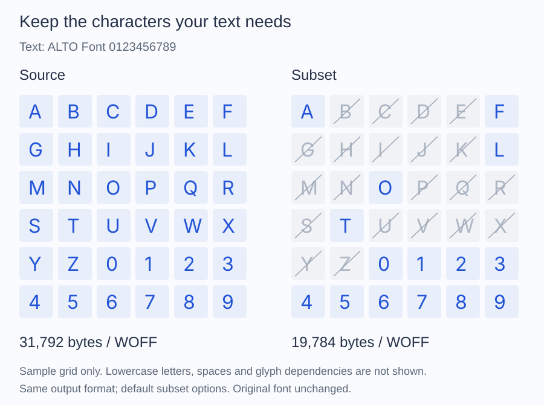

<h1 align="center">
  <a href="https://altophp.com/font">
    
  </a>
</h1>

Inspect, convert, and subset font files from PHP. Read a font's family and
style, find a matching face, or keep only the characters your application uses.

<p align="center">
  
  
  <a href="https://packagist.org/packages/alto/font"></a>
  
  <a href="https://github.com/sponsors/smnandre"></a>
</p>

## Read a font

Save this as `inspect.php`, place your font at `fonts/Inter-Regular.ttf`,
and run `php inspect.php`:

```php
<?php

require __DIR__.'/vendor/autoload.php';

use Alto\Font\Font;

$font = Font::fromFile(__DIR__.'/fonts/Inter-Regular.ttf');

printf("%s %s\n", $font->metadata()->family, $font->metadata()->subfamily);
```

For Inter Regular, this prints `Inter Regular`. See
[Getting started](docs/getting-started.md) to check which characters it contains.

## Installation

```sh
composer require alto/font
```

Requires PHP 8.4+, Iconv, and Zlib. Reading WOFF2 also needs the Brotli PHP
extension or executable; [writing WOFF2](docs/convert/woff2.md) requires an
explicit compressor. TTF and WOFF examples need no Brotli dependency.

## Create a smaller font for your text

Create an `output` directory first. Run this as a separate script beside your
`vendor` directory. The destination must not already exist.

```php
<?php

require __DIR__.'/vendor/autoload.php';

use Alto\Font\Font;
use Alto\Font\Subset\SubsetOptions;
use Alto\Font\Subset\UnicodeSet;
use Alto\Font\Writer\WoffWriter;

$font = Font::fromFile(__DIR__.'/fonts/Inter-Regular.ttf');
$result = $font->subset(new SubsetOptions(
    UnicodeSet::fromText('ALTO Font 0123456789'),
));

$destination = __DIR__.'/output/inter-subset.woff';
new WoffWriter()->write($result->font, $destination);

printf("Saved inter-subset.woff (%d bytes)\n", filesize($destination));
```

This creates a WOFF file containing the requested characters available in the
source, plus required glyph dependencies. The original file is unchanged.
Use the full text your application needs: later text may contain characters
excluded from this subset. Read [Create a subset](docs/subset.md) for
missing-character checks, output sizes, and options.



The illustrated subset uses the text above and default options. The exact size
depends on the source font and the selected characters.

## Choose a task

| I want to... | Guide |
| --- | --- |
| Understand files, faces, characters, and glyphs | [Font concepts](docs/fonts.md) |
| Read a font's family, style, or license fields | [Read metadata](docs/inspect/metadata.md) |
| Check whether a font contains my characters | [Getting started](docs/getting-started.md) |
| Inspect files, metadata, glyphs, and variations | [Inspect fonts](docs/inspect.md) |
| Convert glyph names to Unicode text | [Glyph names](docs/inspect/glyph-names.md) |
| Convert a font to TTF, WOFF, or WOFF2 | [Convert a font](docs/convert.md) |
| Reduce a font to the text I use | [Create a subset](docs/subset.md) |
| Find a font by family, weight, and style | [Find a font](docs/inspect/discovery.md) |
| Inspect variable-font axes and glyph measurements | [Variable fonts](docs/inspect/variations.md) |
| Check supported containers and outline formats | [Font formats](docs/formats.md) |

The [documentation index](docs/index.md) lists every main guide.

## Supported fonts

ALTO Font supports TrueType outlines in TTF/OpenType, WOFF, and WOFF2 files,
and individual faces from TTC/OTC collections. CFF/CFF2 outlines, color glyphs,
and WOFF2 collections are unsupported. See [Formats](docs/formats.md) for
operation-specific limits.

Variable fonts can retain their axes during conversion and subsetting.
Exporting a fixed weight from a variable font is not supported.
ALTO Font reads and transforms font data; text shaping and rendering are
handled by the application or browser using the output.

## Contributing

Contributions of all kinds are welcome. Visit the
[project on GitHub](https://github.com/altophp/font) to
[report a bug](https://github.com/altophp/font/issues/new),
[suggest a feature](https://github.com/altophp/font/issues/new), or
[open a pull request](https://github.com/altophp/font/pulls).

Before submitting code, run:

```bash
# Runs PHP CS Fixer, PHPStan, and PHPUnit
composer qa
```

Changes to public behavior should include tests and documentation.

## Support

ALTO Font is open source and independently maintained by
[Simon André](https://smnandre.dev). If it is useful to your work, you can
support its continued development through
[GitHub Sponsors](https://github.com/sponsors/smnandre).

Sharing the package or
[starring it on GitHub](https://github.com/altophp/font) also helps.

## License

ALTO Font is released by [ALTO PHP](https://altophp.com) under the
[MIT License](LICENSE).
