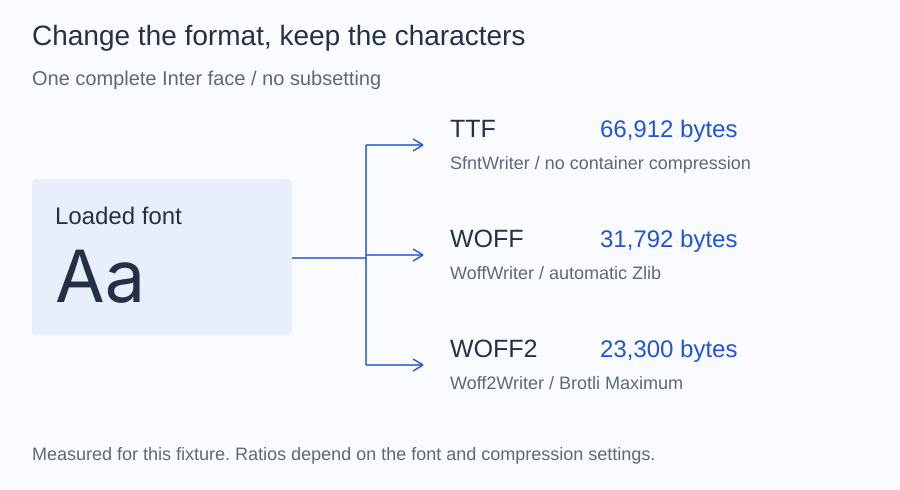

# Convert a font

Write a font in a different file format while keeping its characters. To keep
only selected text, [create a subset](../subsetting/index.md) first.

## Write a WOFF file

Place your source at `fonts/Inter-Regular.ttf`, create an `output` directory,
and run this script beside `vendor`. Use a destination that does not exist.

```php
<?php

require __DIR__.'/vendor/autoload.php';

use Alto\Font\Font;
use Alto\Font\Writer\WoffWriter;

$font = Font::fromFile(__DIR__.'/fonts/Inter-Regular.ttf');
$destination = __DIR__.'/output/inter.woff';

new WoffWriter()->write($font, $destination);

printf("Saved inter.woff (%d bytes)\n", filesize($destination));
```

You now have `output/inter.woff`, ready to reference from your application.
WOFF compression is automatic. The original file is unchanged.

Running the script again with the same destination raises `FontWriteException`.
Choose a new path, or explicitly manage replacement in your application.
See [writer failures](writers.md#handle-failures) for other writing failures.

## Choose another output

| Desired file | Writer | Additional requirement |
| --- | --- | --- |
| Standalone TrueType (`.ttf`) | `SfntWriter` | None |
| WOFF (`.woff`) | `WoffWriter` | None beyond the required Zlib extension |
| WOFF2 (`.woff2`) | `Woff2Writer` | A configured Brotli compressor |

Use the same load-and-write workflow with the selected writer. See
[Writers](writers.md) for TTF output and extracting a collection
face, or [Write WOFF2](../compression/woff2.md) for both Brotli options.



This fixture produces 66,912 bytes as TTF, 31,792 as WOFF, and 23,300 as WOFF2
with Brotli Maximum. No characters were removed. Other fonts and compression
versions can produce different ratios. [Measurement details](../reference/documentation-figures.md).

## What is preserved?

Conversion keeps the face's character and glyph data. Variable fonts retain
their axes; choosing a weight with `withVariations()` does not make that view
exportable as a static font.

Only supported TrueType outlines can be converted. Changing a file's extension
does not convert CFF outlines into TrueType. See [Formats](../formats.md).
Webfont container metadata and private blocks are not preserved when rewriting.
Details of reconstruction are in [Writers](writers.md).

Use `dump()` instead of `write()` when a storage API needs bytes rather than a
local file. Both are described in the [writer reference](writers.md).
