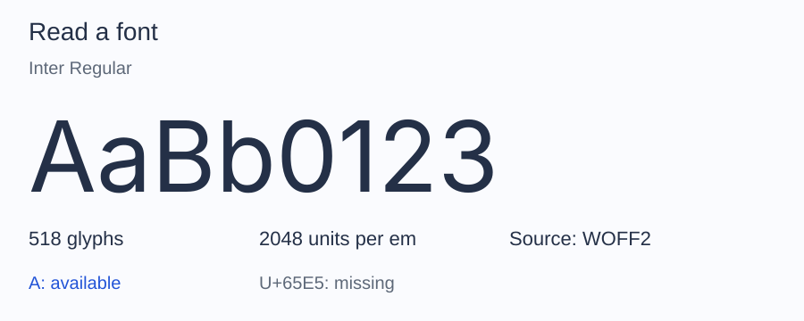

# Getting started

Read a font's family and style, then check whether it contains the characters
in your text. This gives you a first check before using that font in an
application or preparing a subset.

Install the package as described in [Installation](installation.md). Put a
TrueType font at `fonts/Inter-Regular.ttf` beside your `vendor` directory, or
change the path below to your own font.

Save this as `inspect.php` and run `php inspect.php`:

```php
<?php

require __DIR__.'/vendor/autoload.php';

use Alto\Font\Font;

$font = Font::fromFile(__DIR__.'/fonts/Inter-Regular.ttf');
$metadata = $font->metadata();

printf("Family: %s\nStyle: %s\n", $metadata->family, $metadata->subfamily);
```

For Inter Regular, the output is:

```text
Family: Inter
Style: Regular
```

The values come from your font; ALTO Font does not download Inter for you.
Loading a font leaves the original file unchanged.



This is the bundled Inter Latin sample. Your file may contain a different
character set or glyph count. [Figure source](reference/documentation-figures.md).

## Check whether the font contains your text

Add this to the same script:

```php
use Alto\Font\Subset\UnicodeSet;

foreach (UnicodeSet::fromText('Café') as $codepoint) {
    printf(
        "U+%04X: %s\n",
        $codepoint,
        null === $font->glyphIdForCodepoint($codepoint) ? 'missing' : 'available',
    );
}
```

With the Inter Latin sample, the added block prints each distinct codepoint
in ascending order:

```text
U+0043: available
U+0061: available
U+0066: available
U+00E9: available
```

`missing` means the font has no character mapping for it. ALTO Font does not
select a replacement font. This checks character availability, not whether a
whole phrase will shape or render correctly.

## Continue with your font

Continue with [Read metadata](metadata.md) to inspect version, style, and
license fields. If file, face, or glyph terminology is unfamiliar, read
[Font concepts](fonts.md).

If loading fails, see [loading failures](font-files.md#when-a-font-will-not-load).
