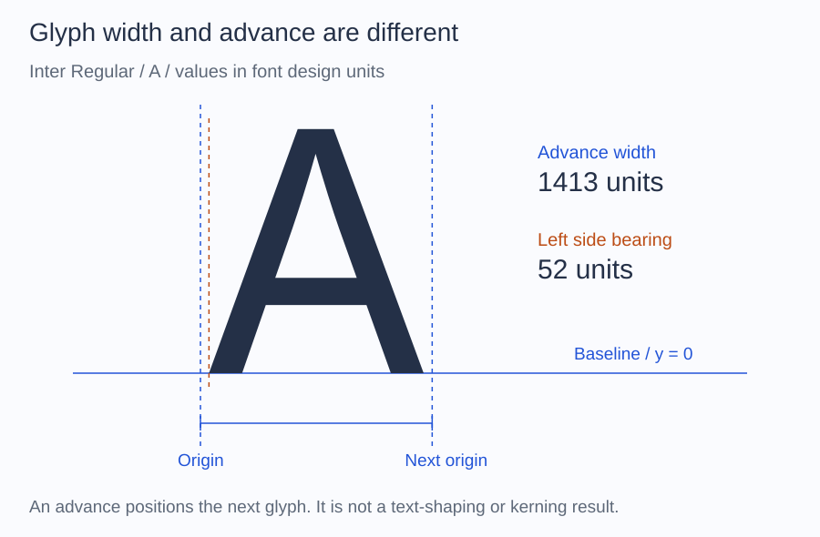
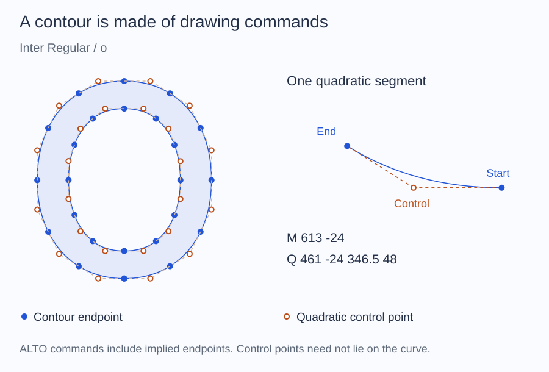

# Glyphs

Font files map Unicode code points to glyph identifiers. Glyph identifiers are
font-specific and must not be reused with another font.

## Resolve a character

Place a font at `fonts/Inter-Regular.ttf` and run this script beside `vendor`.
The remaining examples continue with the same `$font`:

```php
<?php

require __DIR__.'/vendor/autoload.php';

use Alto\Font\Font;

$font = Font::fromFile(__DIR__.'/fonts/Inter-Regular.ttf');
$glyphId = $font->glyphIdForCodepoint(0x00E9); // é

echo null === $glyphId ? "é is missing\n" : "é is available\n";
```

`glyphIdForCodepoint()` returns `null` when the font's character map has no
entry. It does not perform font fallback.

When working with one character, `metrics()` resolves it and reports a
clear failure if it is absent:

```php
$metrics = $font->metrics('A');

printf("Glyph: %d\n", $metrics->glyphId->value);
printf("Advance: %d\n", $metrics->advanceWidth);
printf("Side bearing: %d\n", $metrics->leftSideBearing);
```

Passing invalid UTF-8, an empty string, or more than one Unicode code point
raises `InvalidTextException`. A valid character absent from the font raises
`GlyphNotFoundException`. Use the explicit code-point method when absence is
expected.

## Read metrics by identifier

```php
$glyphId = $metrics->glyphId;
$metrics = $font->glyphMetrics($glyphId);
```

The advance width and side bearing use the font's design units, not pixels.



In this Inter fixture, `A` advances by 1,413 units and has a 52-unit left side
bearing. Advance width is the distance to the next origin before shaping;
it is not the width of the visible ink. [Source](reference/documentation-figures.md).

## Read an outline

```php
$outline = $font->glyphOutline($glyphId);

if ($outline->isEmpty()) {
    // Spaces and other non-drawing glyphs can have no contours.
}

foreach ($outline->contours as $contour) {
    foreach ($contour->commands as $command) {
        // M, L, Q, or Z with their design-unit coordinates.
    }
}
```

`M`, `L`, `Q`, and `Z` represent move, line, quadratic curve, and close-path
commands. ALTO Font exposes this neutral geometry without serializing it to
SVG, a bitmap, or another drawing format.



Filled points are contour endpoints; hollow points are quadratic controls.
The enlarged segment is taken directly from `glyphOutline()`. A control point
need not lie on the curve. ALTO's commands include implied endpoints, so these
markers are not an inventory of the original stored font points.

The SVG serializer lives in the documentation tooling; `glyphOutline()` itself
returns geometry rather than an SVG file.

## Transform geometry

Outlines, contours, and path commands accept a two-dimensional affine
transform:

```php
$scale = 16 / $font->face()->unitsPerEm;

$scaled = $outline->transform(
    xx: $scale,
    yx: 0,
    xy: 0,
    yy: -$scale,
    dx: 0,
    dy: 16,
);
```

The example scales the outline to 16 units, flips the font's upward Y axis,
and moves the baseline. It still does not draw the result.
