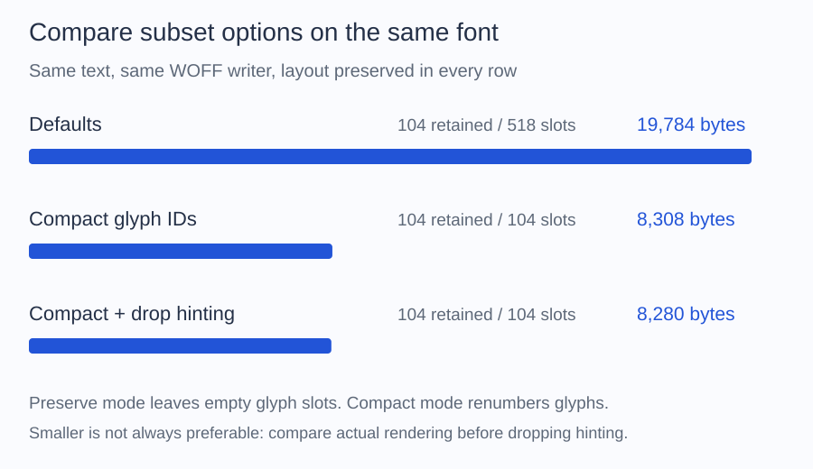

# Choose subset options

Start with the defaults in [Create a subset](index.md). Change one
option at a time and compare the output in the application that uses it.

| Option | Default | When to change it |
| --- | --- | --- |
| Glyph numbering | `GlyphIdPolicy::Preserve` | Try `Compact` when you need smaller output and the font supports it |
| Hinting | `HintingPolicy::Keep` | Try `Drop` if smaller output matters more than preserving small-size rendering |
| Text layout | `LayoutPolicy::Preserve` | Remove data only for controlled content that does not need it |



All three examples retain 104 glyphs and preserve layout. Default output is
19,784 bytes with 518 slots; compact output is 8,308 bytes with 104 slots.
Dropping hinting reduces this sample to 8,280 bytes. The small additional saving
does not establish that removing hinting is appropriate for your renderer.
[Measured source and options](../reference/documentation-figures.md).

## Compact glyph numbers

Run this as a separate script beside `vendor`, with a source font and an
existing `output` directory. The destination must be new.

```php
<?php

require __DIR__.'/vendor/autoload.php';

use Alto\Font\Font;
use Alto\Font\Subset\GlyphIdPolicy;
use Alto\Font\Subset\SubsetOptions;
use Alto\Font\Subset\UnicodeSet;
use Alto\Font\Writer\WoffWriter;

$font = Font::fromFile(__DIR__.'/fonts/Inter-Regular.ttf');
$characters = UnicodeSet::fromText('ALTO Font 0123456789');
$result = $font->subset(new SubsetOptions(
    $characters,
    glyphIds: GlyphIdPolicy::Compact,
));

$destination = __DIR__.'/output/inter-compact.woff';
new WoffWriter()->write($result->font, $destination);

printf("Saved inter-compact.woff (%d bytes)\n", filesize($destination));
```

Compact mode closes gaps in glyph numbering and rewrites the related data.
Compare its file size with a default subset written in the same format.
It can reject fonts containing structures that cannot be safely rewritten;
see the [support reference](../reference/opentype-subsetting.md).

Keep the default if another part of your application stores original glyph
identifiers. Compact mode also removes glyph names. Even with matching
outlines and positioning, rendering can change on some platforms; compare
small text as well as large text before shipping.

## Remove hinting

To test this option, replace the `SubsetOptions` call in your script with:

```php
use Alto\Font\Subset\HintingPolicy;

$result = $font->subset(new SubsetOptions(
    $characters,
    hinting: HintingPolicy::Drop,
));
```

Hinting helps render glyphs at small sizes. Removing it can reduce the file,
but may change sharpness or spacing on the target renderer. Keep it unless
you have checked the sizes and devices your application uses.

## Remove text layout data

Keep `LayoutPolicy::Preserve` for ordinary text. Layout data controls behavior
such as ligatures, joining, and mark placement.

`LayoutPolicy::SubstitutionsOnly` keeps supported substitutions but removes
OpenType positioning. `LayoutPolicy::Drop` removes both. These options can
break prose or scripts that depend on shaping; reserve them for controlled
content such as isolated symbols. Legacy kerning is retained independently,
so `Drop` does not mean every kerning adjustment is removed.

## Subset a variable font

Subset the original variable font. Supported axes remain available in the
output. Exporting a fixed weight or restricting axis ranges is unsupported.

If you obtained a selected view from `withVariations()` or a weighted finder
query, call `withoutVariations()` before subsetting. This returns to the full
variable source; it does not keep only the selected weight.

Always review `SubsetResult::$warnings`. For precise table and offset limits,
see [OpenType subsetting support](../reference/opentype-subsetting.md).

## Check output size and rendering

Required compound glyphs and substitution dependencies may remain even when
they were not requested. Preserve mode also keeps original glyph slots. Compare
actual files in the same format before changing policies: `sfntSize` measures
uncompressed font data, while `filesize()` measures the written container.
`font->face()->glyphCount` includes empty preserved slots; `retainedGlyphCount`
counts retained glyphs.

For a visible difference, start with default options, retain hinting and layout,
and compare your application's text at its actual display sizes. Include all
required accents and characters. Matching outlines and positioning do not
guarantee matching pixels on every renderer. Recursive has a documented CoreText
dependency on glyph names and additional glyphs; its
[technical diagnosis](https://github.com/altophp/font/blob/main/tests/Validation/RECURSIVE_RENDERING.md) and narrow
workaround do not establish rendering fidelity for other fonts.
