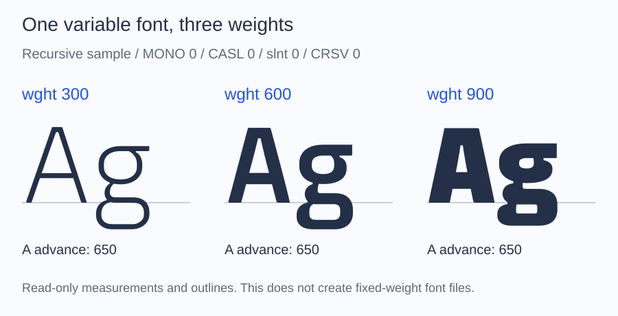

# Inspect a variable font

A variable font can contain a range of weights or widths in one file. ALTO
Font lets you list those axes and read glyph measurements or outlines at
chosen coordinates.

These selections are read-only views. They cannot be exported or subsetted as
fixed-weight fonts. To convert or subset with all axes preserved, use the
original variable font.

## List the available axes

Place a variable TrueType font at `fonts/Variable.ttf`, then run this script
beside `vendor`:

```php
<?php

require __DIR__.'/vendor/autoload.php';

use Alto\Font\Font;

$font = Font::fromFile(__DIR__.'/fonts/Variable.ttf');
$variations = $font->variations();

if (null === $variations) {
    echo "This is a static font.\n";
} else {
    foreach ($variations->axes as $axis) {
        printf(
            "%s: %g to %g, default %g\n",
            $axis->tag,
            $axis->minimum,
            $axis->maximum,
            $axis->default,
        );
    }
}
```

For a weight axis, a line might be `wght: 100 to 900, default 400`. The actual
ranges depend on the file. Axes also expose their optional name and hidden
flag; named presets are available through `$variations->instances`.

## Compare a glyph at another weight

Continue the script with a font that has a `wght` axis and contains `A`:

```php
if (null === $variations || !$variations->hasAxis('wght')) {
    throw new RuntimeException('Choose a variable font with a weight axis.');
}

$bold = $font->withVariations(['wght' => 700]);

printf("Default A advance: %g\n", $font->metrics('A')->advanceWidth);
printf("Selected A advance: %g\n", $bold->metrics('A')->advanceWidth);
```

Both values are in font design units. They may be equal if that glyph's advance
does not vary. Use `$bold->glyphOutline($bold->metrics('A')->glyphId)` to read
its selected outline as well. The original `$font` remains unchanged.

Values outside an axis range are clamped. Unknown axes and selections on
static fonts raise `InvalidFontException`. Query the available axes before
assuming that a font has width (`wdth`) or any other axis.



This uses the bundled Recursive-derived sample, with the other axes fixed as
shown. The outline changes while `A` keeps the same 650-unit advance. Each
column comes from an ALTO read-only view; no static font was exported. Glyphs
are placed by their advances without text shaping or kerning.
[Fixture and axis settings](reference/documentation-figures.md).

## Return to the source for conversion or subsetting

`$bold->withoutVariations()` returns the original variable source with all its
axes. It does not freeze weight 700. A weighted [finder query](discovery.md)
can also return a selected view, with the same writing restrictions.

## Coordinate API

Pass an array to `withVariations()` as above, or build a
`VariationCoordinates` object with `defaults($variations)` and `with()`.
`variationCoordinates()` reports the selected coordinates.

Measurements and outlines use supported TrueType variation data (`avar`,
`gvar`, and `HVAR`). Text shaping and rendering at those coordinates are the
responsibility of the application using the font.
